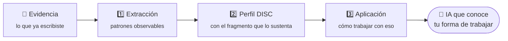

# 🔍 Marca Personal con IA — Perfil Forense


> Taller de Relevo. Diagnóstico de perfil **DISC a partir de evidencia conversacional real** — no de un test de autopercepción. Tres prompts que se corren en una sola conversación.

**[🌐 curso.relevo.academy](https://curso.relevo.academy/)** · **[📸 @relevo.academy](https://instagram.com/relevo.academy)** · **[✉️ relevoacademy@gmail.com](mailto:relevoacademy@gmail.com)**

---

## 📑 Tabla de contenidos

- [✨ Qué es](#-qué-es)
- [🧠 Por qué la evidencia le gana al autorreporte](#-por-qué-la-evidencia-le-gana-al-autorreporte)
- [🎯 Qué trae](#-qué-trae)
- [🗺️ Cómo funciona](#️-cómo-funciona)
- [🎨 Identidad](#-identidad)
- [🚀 Correr localmente](#-correr-localmente)
- [📁 Estructura](#-estructura)
- [🔗 Piezas relacionadas](#-piezas-relacionadas)

---

## ✨ Qué es

Un test de personalidad le pregunta a alguien cómo cree que es. Un **diagnóstico** mira lo que esa persona ya hizo.

Este taller usa lo segundo: toma la evidencia conversacional que ya existe y saca de ahí un perfil DISC. Después muestra qué cambia cuando la IA con la que se trabaja **conoce ese perfil**.

Es un beneficio gratuito para quienes siguen a [@relevo.academy](https://instagram.com/relevo.academy), como cortesía del **Cripto Latin Fest 2026**.

---

## 🧠 Por qué la evidencia le gana al autorreporte

| | Test de autopercepción | Diagnóstico con evidencia |
|---|---|---|
| **Fuente** | Lo que la persona cree de sí misma | Lo que la persona efectivamente escribió |
| **Sesgo** | Deseabilidad social, humor del día | Acotado por el registro real |
| **Verificable** | No | Sí — se puede señalar el fragmento |
| **Cambia con el ánimo** | Bastante | Poco |

> No es que el autorreporte no sirva. Es que **cuando existe evidencia, preguntarle a la memoria es la peor de las dos opciones disponibles**.

---

## 🎯 Qué trae

| Sección | Contenido |
|---------|-----------|
| 🎬 **Presentación** | 10 diapositivas, todas del mismo alto y sin bordes muertos |
| 🧰 **Los 3 prompts** | Listos para copiar y correr en una sola conversación |
| 📖 **Vocabulario** | 11 términos explicados sin jerga |

Las diapositivas responden, en orden: qué separa un diagnóstico de un test, qué mide DISC realmente, por qué la evidencia gana, y **qué valor concreto genera** que la IA conozca el perfil.

---

## 🗺️ Cómo funciona



**Decisiones de diseño:**

- **Los tres prompts corren en una sola conversación.** Cada uno usa lo que produjo el anterior; separarlos en chats distintos rompe la cadena.
- **Cada rasgo del perfil viene con su evidencia.** Un diagnóstico que no puede señalar de dónde salió una conclusión es un test disfrazado.
- **Las diapositivas tienen alto fijo.** La tarjeta no cambia de tamaño al avanzar, así la barra de navegación no se mueve bajo el cursor mientras se dicta en vivo.

---

## 🎨 Identidad

Sigue el `RELEVO_MANUAL DE IDENTIDAD`, igual que las otras piezas de la marca.

| Token | Valor |
|-------|-------|
| Negro | `#050505` |
| Carbón | `#131415` |
| Turquesa | `#1FE6AB` |
| Gris | `#A7ABAF` |
| Títulos y cuerpo | Instrument Sans |
| Datos y prompts | IBM Plex Mono |

**El ámbar `#E8A33D` se usa solo para advertencias.** Esa restricción es lo que hace que la marca lea profesional: si se usa para decorar, deja de alertar.

> ⚠️ El manual trae **dos erratas**. El hex del gris figura como `#67A6A3` pero sus propios valores RGB (167, 171, 175) dan `#A7ABAF`. Y la tipografía aparece como *"Instrumental Sans"* cuando la real es **Instrument Sans**.

---

## 🚀 Correr localmente

Sitio estático, sin build ni dependencias.

```bash
python -m http.server 8820
```

**Desplegar:** subir la carpeta tal cual. En Vercel, framework **Other**, sin build command, output directory la raíz.

> ⚠️ Conectar desde la cuenta de Vercel **de Relevo**. Verificar la cuenta activa antes de importar, no después.

---

## 📁 Estructura

| Ruta | Contenido |
|------|-----------|
| `index.html` | El taller completo, sin dependencias externas |
| `assets/relevo-lockup.png` | Logo horizontal |
| `assets/relevo-lockup-v.png` | Logo vertical |

---

## 🔗 Piezas relacionadas

| Repositorio | Qué es |
|-------------|--------|
| [`modulo-conoce`](https://github.com/relevoacademy/modulo-conoce) | Taller 01 CONOCE — Claude a fondo |
| [`landing-curso-conoce`](https://github.com/relevoacademy/landing-curso-conoce) | Página de venta del curso |

---

Hecho con 💜 en Colombia 🇨🇴 · **Relevo — IA que trabaja contigo**
